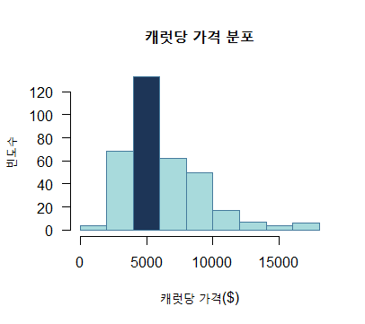
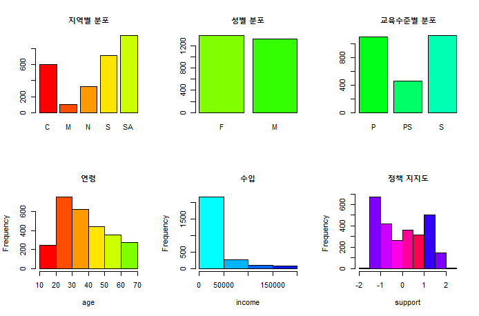
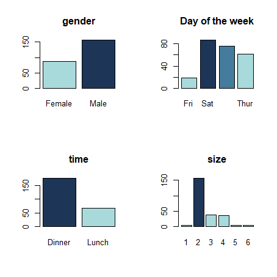
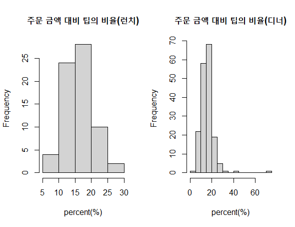

### Chapter 08 기본 그래프 작성하기 I

# 01-barplot ([막대그래프 LAB](./Ch08-01-barplot.R))
###### 해당 자료의 "갯수"

# 02-histogram ([히스토그램 LAB](./Ch08-02-histogram.R))
###### 자료를 "구간"으로 나눔 

# 03-multiple graph ([다중그래프 LAB](./Ch08-03-multipleGraph.R))

# 04-practise ([실전분석](./Ch08-04-practise.R))

# 05-exercise ([연습문제](./Ch08-05-exercise.R))

