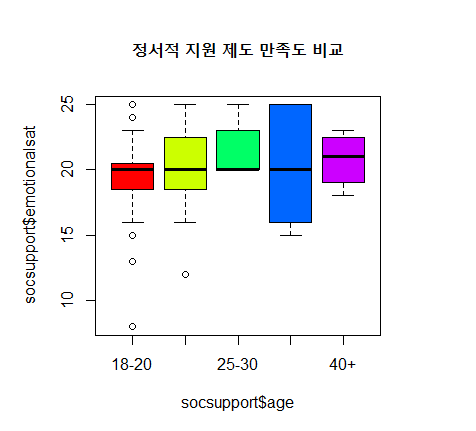

### Chapter 09 기본 그래프 작성하기 II

# 01-Circle, Line Graph ([원, 선그래프 LAB](./Ch09-01-clGraph.R))

# 02-Box Graph ([상자그림 LAB](./Ch09-02-boxGraph.R))

# 03-Scatter Plot ([산점도 LAB](./Ch09-03-scatterPlot.R))

# 04-practise ([실전분석](./Ch09-04-practise.R))

# 05-exercise ([연습문제](./Ch09-05-exercise.R))
###### 01

###### 02

###### 03

###### 04

###### 05
